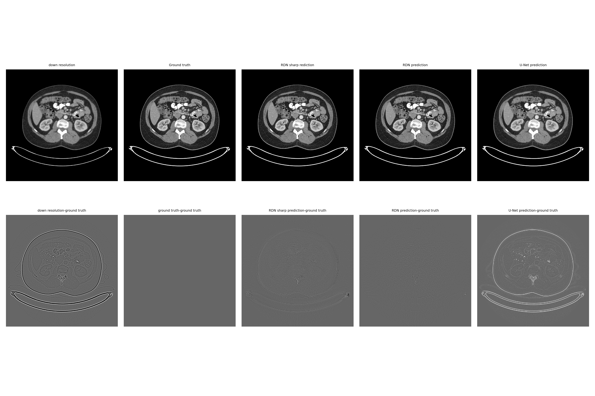
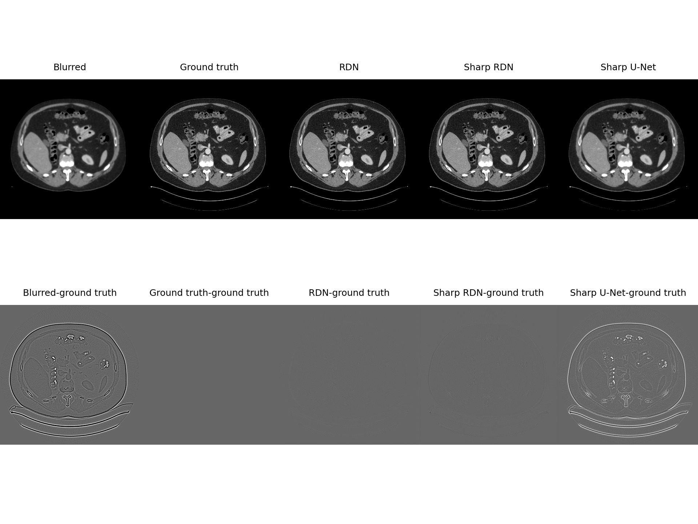
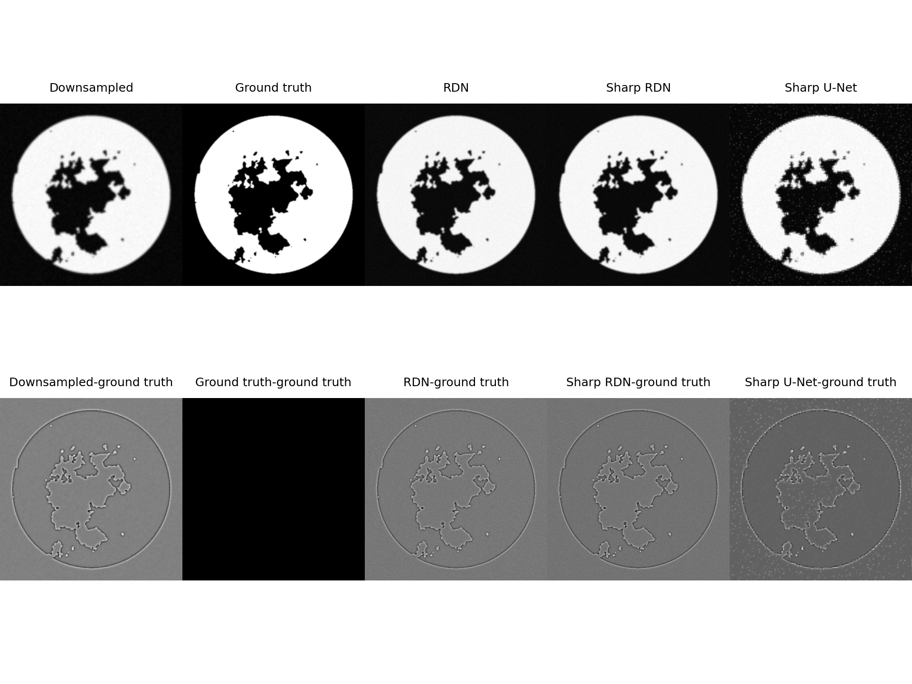
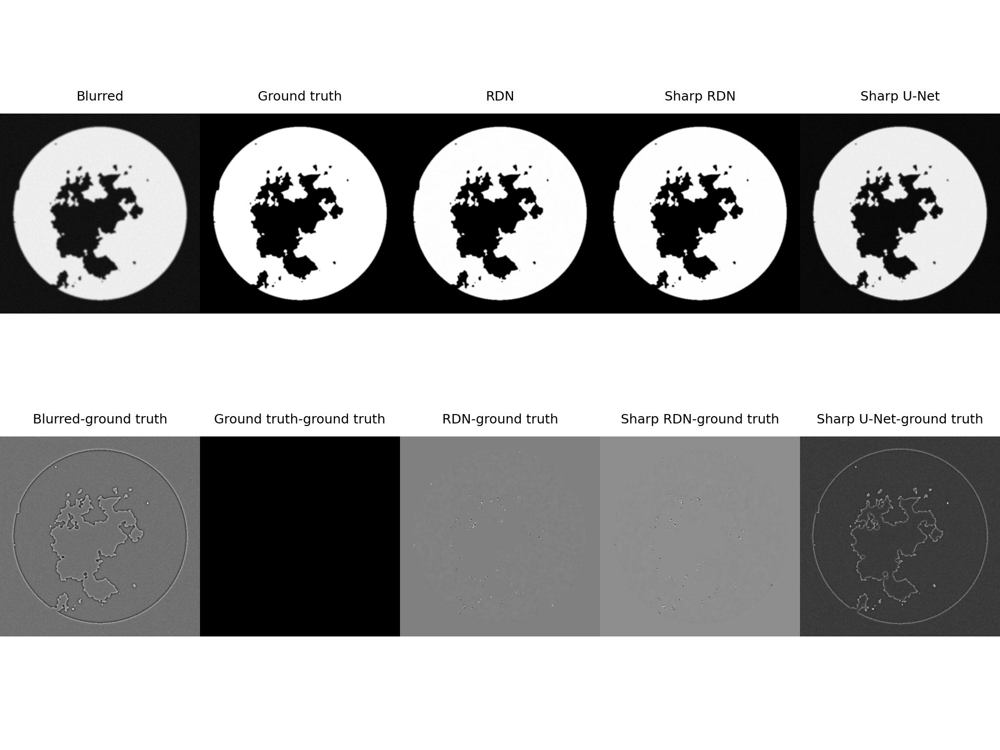

# ISEF2022

## Introduction

### RDN

The number of RDB, learning rate, and number of kernels for each layer used for the AAPM is 5, 0.001, and 64. However, the number of RDB used for the TCIA data set is 10. Since the model is built in a subclass method, the number RDB and number of kernels for each layer can not be changed. Since all of the data used for trainning is gray images, the input channle and output channel is always 1. 

### Sharp RDN

The number of RDB, learning rate, and number of kernels for each layer used for the AAPM is 5, 0.001, and 64. However, the number of RDB used for the TCIA data set is 10. The only difference between the RDN and Sharp RDN is that there is a Sharpen Layer added to the RDN.
### Sharp U-net 

For the U-Net, the output and the input image size must be the same, therefore, to perform the super resolution, the image is first up resolutioned then went through a similar process as "deblur."

### Running the program
All of the program is ran in Google Colab.

## Usage 

### analyze.py
This program would calculate the PSNR, RMSE, and SSIM of the input.

### predict.py
This program would take the weights and the input and predict the output(whether it is super resolution or deblurring).

### sobel.py

This is sobel for the Sharpen.

### train.py

This program is used to train the models.

### utils.py
This is the util function, such as blur and down resolution, for the dataset.

### RDN.py
The RDN model

### Sharp_RDN.py

The RDN model but with the Sharpen layer added to it

### Sharp_Unet.py

The Sharp U-net model.

## Resuls
1. TCIA super resolution

2. TCIA deblur

3. AAPM super resolution 

4. AAPM deblur

## Thanks to:
RDN program inspired by: https://github.com/cjdsj/RDN-for-SR-by-keras
